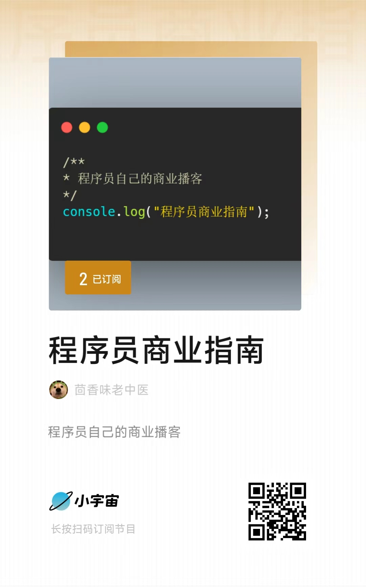

# Programmer-Business-Guide(程序员商业指南)

> 程序员如何快速开始自己的商业之旅，无论是独立开发又或者组队创业，都应该了解的内容。

## 章节

[定价策略](https://mp.weixin.qq.com/s?__biz=MzI2ODIwMzI4MQ==&mid=2651742185&idx=1&sn=e1643da62f62d6ed0036c8f26ca6729b&chksm=f109db97c67e5281493a2a9cec9ed837b087e16fb573db90b71503ede808334bcc8405deeed2&token=155880087&lang=zh_CN#rd)
## 其他平台
| 知识库 | 小宇宙 | 视频号 |
| :-----| ----: | :----: |
| 建设中 |  |  |

## 关于我们
联系我：🛰：iodto1
